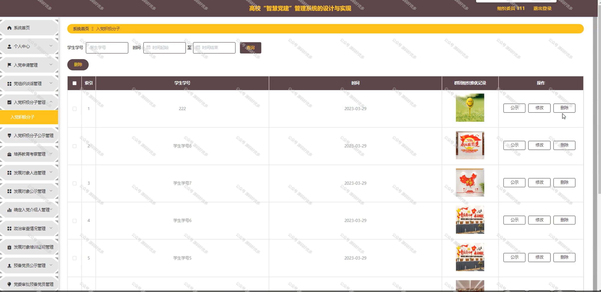

 
## 查看主页获取源码

### 一、作品包含

源码+数据库+全套环境和工具资源+部署教程

### 二、项目技术

前端技术：Html、Css、Js、Vue、Element-ui

数据库：MySQL

后端技术：Java、Spring Boot、MyBatis

  

### 三、运行环境

开发工具：IDEA/eclipse

数据库：MySQL5.7

数据库管理工具：Navicat10以上版本

环境配置软件： JDK1.8+Maven3.6.3

前端Nodejs：14

### 四、项目介绍
项目编号：springbootA155

高校“智慧党建”管理系统的背景是为了适应新时代党的建设总要求，利用现代信息技术提升高校党建工作的科学化、规范化、智能化水平，通过集成党务管理、党员教育、组织生活、信息发布等功能，实现党建资源的有效整合和高效利用，推动高校党建工作创新发展，增强党组织的凝聚力和战斗力。

系统分为管理员、用户、组织委员
管理员的功能：系统首页、个人中心、组织委员管理、学生管理、入党申请管理、党组织谈话管理、入党积极分子管理、入党积极分子公示管理、培养教育考察管理、发展对象人选管理、发展对象公示管理、确定入党介绍人管理、政治审查情况管理、发展对象培训证明管理、预备党员公示管理、党委审批预备党员管理。
学生的功能：系统首页、个人中心、入党申请管理、党组织谈话管理、入党积极分子管理、入党积极分子公示管理、培养教育考察管理、发展对象人选管理、发展对象公示管理、确定入党介绍人管理、政治审查情况管理、发展对象培训证明管理、预备党员公示管理。
组织委员的功能：系统首页、个人中心、入党申请管理、党组织谈话管理、入党积极分子管理、入党积极分子公示管理、培养教育考察管理、发展对象人选管理、发展对象公示管理、确定入党介绍人管理、政治审查情况管理、发展对象培训证明管理、预备党员公示管理、党委审批预备党员管理。

### 五、运行截图

  

